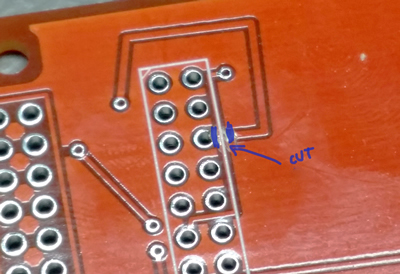
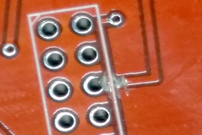
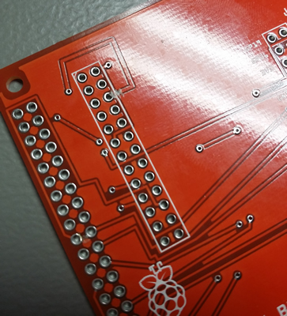
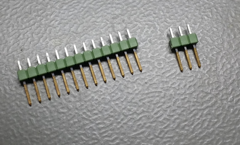
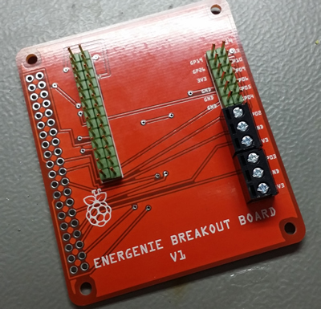
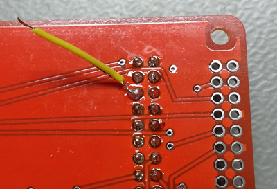
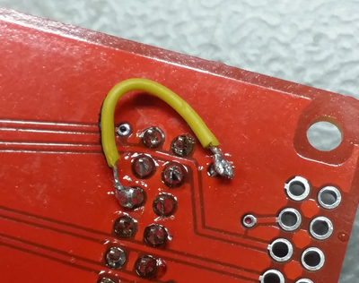
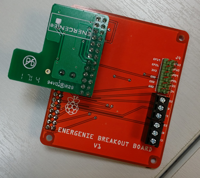

V1   - Do not make more of these.
===============

Errors:
* Energenie module points the wrong way.
* Rogue ground thread shorts out data pin.

Assembling the board.

1. **DO THIS BEFORE SOLDERING ON THE HEADERS**. Disconnect ground thread at the cross roads to prevent shorting. You can do this with a scalpel. Make sure you cut in parallel with the silkscreen line as shown.

1. Solder on headers and screw terminals.

1. Reroute the gound pin. Solder to the bottom of the ground pin you have just disconnected. Use a small length of wire to connect it to the top right Via. As shown.

1. Solder on 2x20 way header.
1. Fit energenie module in direction shown below.

1. In future there will be tiny breadboards to stick in the blank space in the middle of the board. ETA in the office is late January.

